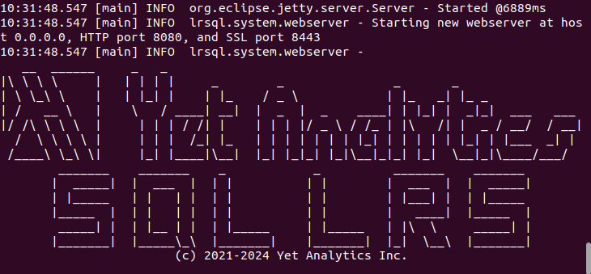
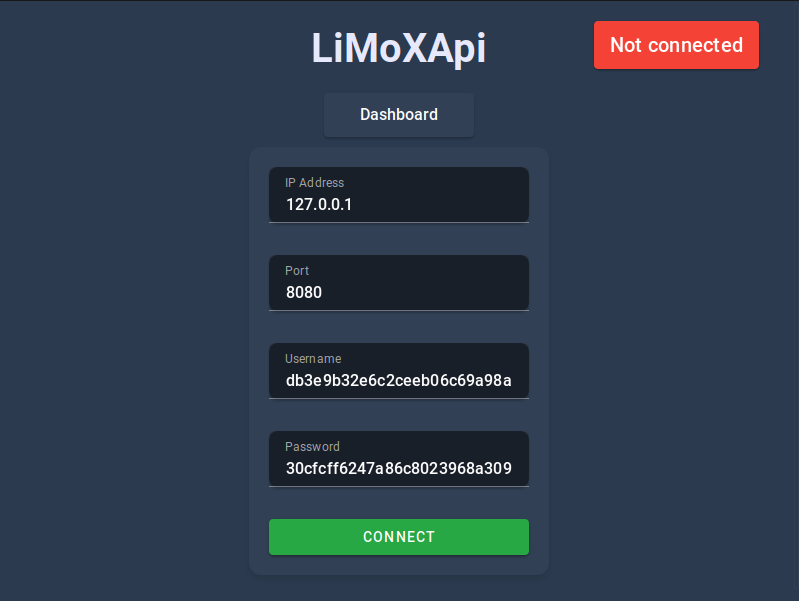
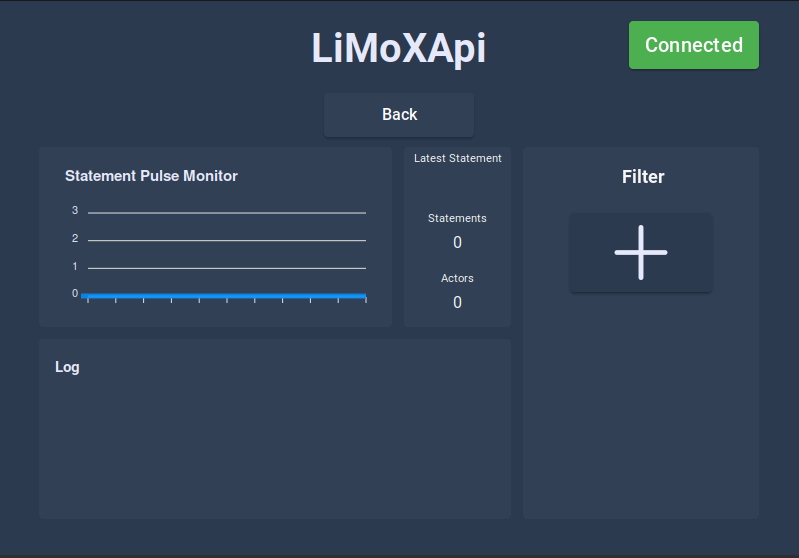
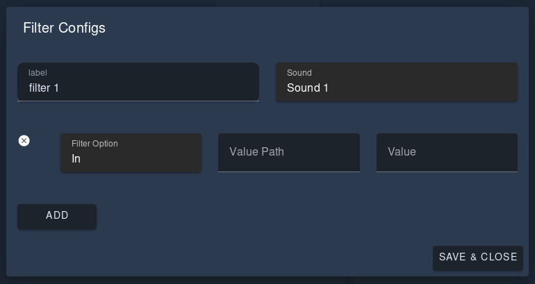

# LiMoxAPI

LiMoxAPI (**Li**ve **Mo**nitoring **xAPI**) is a tool to monitor environment that use xAPI to create Statements with a focus on VR apps. It is not directly monitoring the software that is generating the statements but the connected LRS. The purpose of LiMoxAPI is support developers during development process.

## Setup

### Setup YetAnalytics (optional)
It is recommended to use the YetAnalytics LRS that you can findy preconfigured under releases. You need a JavaJDK to the LRS.

1. Download YetAnalytics.zip under [releases](https://github.com/Ipagaxi/LiMoxAPI/releases/tag/app-v0.0.0).

2. Unzip YetAnalytics to a location of your choice

3. To start the YetAnalytics LRS open the root directory of extracted file in the terminal. Now type the following command based on your OS:
 - Windows: ```.\lrsql.exe```
 - Linux/MacOS: ```./bin/run_sqlite.sh```

 If it was successfull it should look like this:

 

 For further information visit the YetAnalytics [GitHub Repo](https://github.com/yetanalytics/lrsql)

### LiMoxAPI

You find the suitable installer/binary under [releases](https://github.com/Ipagaxi/LiMoxAPI/releases/tag/app-v0.0.0).

## Usage

1. After setting up everything you just have execute the LiMoxAPI executable.

    The starting view is the connection setup.



2. If you use the preconfigured YetAnalytics than you just have to press **Connect** without changing the credentials. It should successfully connect to the LRS and change the view.

    If you use another LRS you have to change the ip, port, key (username) and secret key (password) accordingly.

### Functionalities

On the Dashboard you can see different components.



The Statement Pulse Monitor and the info box to right are straigh forward and give general information over incoming statements.

The Log component logs every incoming statement reduced to its easy to read informations. By clicking on a log the full statement gets displayed.

On the right side is the filter component where you can add filter.
After adding a filter you can configure that filter by clicking on the gear icon next to it. 



Here you can set a label for the filter, filter rules and the sound that notifes you whenever a statement valid to this filter rules comes in.
Under `Value Path` you determine the path to the specific value in the json statement and under `Value` its value. `Filter Option` determines if every statement must contain the specified value (`In`) or if it exclude every statement with this value (`Out`).

For example: `Filter Option` = `In`, `Value Path` = `actor.name` and `Value` = `Player1` $\\$
$\Rightarrow$ This filter counts every statement with actors of the name `Player1`.

The filter does not affect the other components.

## Build

1. Install cargo, see [here](https://www.rust-lang.org/tools/install) for options

2. Install bun, see [here](https://bun.sh/docs/installation) for options

3. You may need to install specific dependencies based on your OS, see [here](https://tauri.app/v1/guides/getting-started/prerequisites) for more instructions

4. Open the terminal and install tauri-cli: 
```cargo install tauri-cli```

5. Download the project source code, unpack it and open it in the terminal

6. Run: ```bun install```

7. Now you can run the project in the runtime via ```cargo tauri dev```
    
    Or build the bundles via ```cargo tauri build```. You can find the built artifacts under `./src-tauri/target/release`
    
For further information visit the [Tauri Website](https://tauri.app/)
